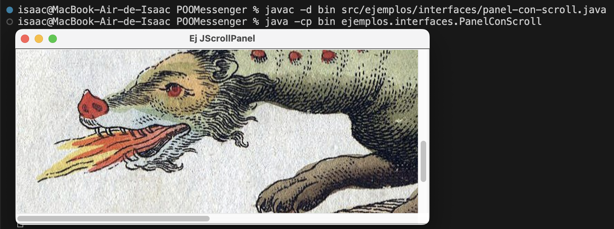

# Notas
## Estructura
POOMessenger/  
....src/  
........ejemplos/  
............interfaces/  
................archivo1.java  
................archivo2.java  
....bin/  
........ejemplos/  
............interfaces/  
................Clase1.class  
................Clase2.class
....resources/  
........imagenes,etc

 
### ¿Que guarda cada carpeta?
- src: contiene archivos.java dentro de paquetes
- bin: contiene archivos.class para ejecutarse
- resources: guardar archivos como imagenes, videos, etc.

## ¿Como compilar y ejecutar?
### Para compilar:
(Tienes que estar en la carpeta inicial osea POOMessenger)  
javac -d bin src/nombrepaquete/nombreArchivo.java

### Para ejecutar:
(Tienes que estar en la carpeta inicial osea POOMessenger)
java -cp bin nombrepaquete.nombreClase

### Por ejemplo:
javac -d bin src/ejemplos/interfaces/panel-con-scroll.java
java -cp bin ejemplos.interfaces.PanelConScroll

